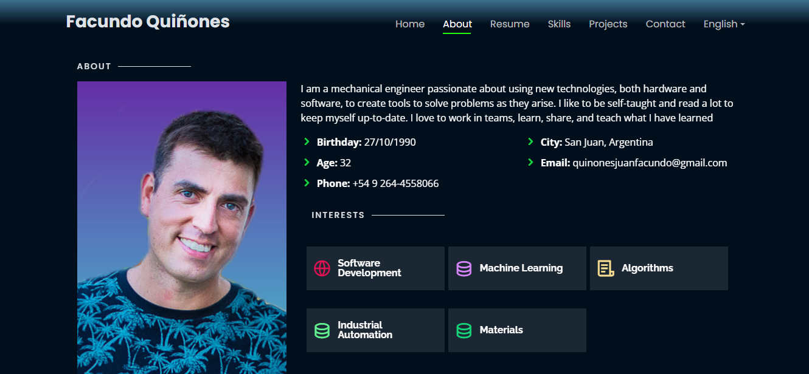

#My  Personal Portfolio 😁
> https://jfquinones.github.io/

### Overview
This is a multilingual, responsive, modularized and easy-customizable portofolio using Jeckyll to adapt it to Github Pages, CSS and Javascript.

:star: Star Me on GitHub — it helps!

[](https://github.com/jfquinones/jfquinones.github.io/commits/master)
[](http://jfquinones.github.io/)
[](https://www.linkedin.com/in/juan-facundo-quiñones/)
[](http://badges.mit-license.org)

### Website Preview
#### Home Page


#### About Page



## Sections 📚
✔️ About\
✔️ Resume\
✔️ Skills\
✔️ Projects\
✔️ Contact\

## How to Use it

- You can fork this repository to a repository with the form <"your-username">.github.io
- To easily change the color of the Portfolio I use a few color vars applied to the whole webpage in the style.css file

```css
   :root {
       --background: #010E1B;
       --highlight:#457B9D;
       --highlight-light: #A8DADC;
       --contrast-font: #FFF ;
       --inactive-font: #DEE2E6;
       --underline: #24ff07;
   }
```

- Almost all the content is in data folder, in which you have the translations for each section
- The layouts of the sections are in the includes folder
- The main information about the autor is in _config.yml file, witch includes social-links and personal data

## Know Issues

There is also a downloadable-resume to PDF file, it use an HTML2pdf javascript file, that can't process external CSS file so you have to manually change de style the downloadable-resume.html file. Another issue about this, is that automatically export HTML as A4 portrait pages, so the PDF maybe have rare looklike. 


